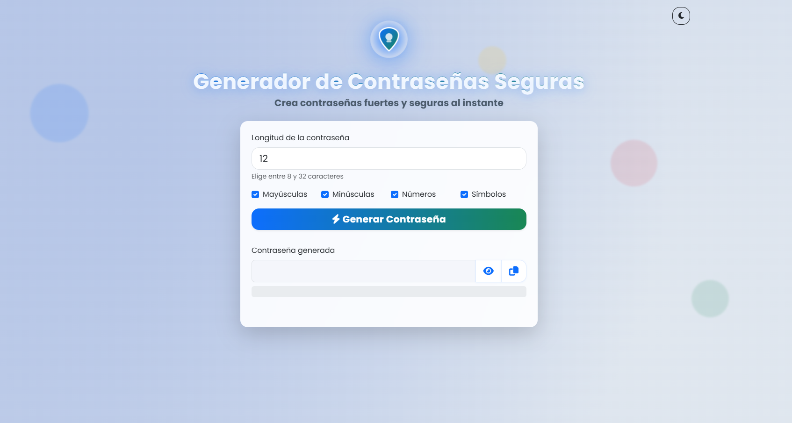

# Generador de Contraseñas Seguras

Generador web moderno y responsivo de contraseñas seguras, desarrollado con HTML, CSS, JavaScript y Bootstrap 5.3. Incluye animación de fondo, modo oscuro, barra de progreso de fortaleza, tooltips, toasts y diseño glassmorphism.

## Características
- Generación de contraseñas seguras y aleatorias
- Opciones configurables: longitud, mayúsculas, minúsculas, números, símbolos
- Barra de progreso animada para la fortaleza
- Modo claro/oscuro con un clic
- Fondo animado moderno (burbujas)
- Tarjeta con efecto glassmorphism
- Tooltips y toasts para mejor experiencia de usuario
- 100% responsivo y funcional

## Vista previa



## ¿Cómo ejecutar?
1. Descarga o clona este repositorio
2. Abre `index.html` en tu navegador
3. (Opcional) Usa un servidor local:
   ```
   python -m http.server 8000
   ```
   Luego visita [http://localhost:8000](http://localhost:8000)

## Licencia
MIT